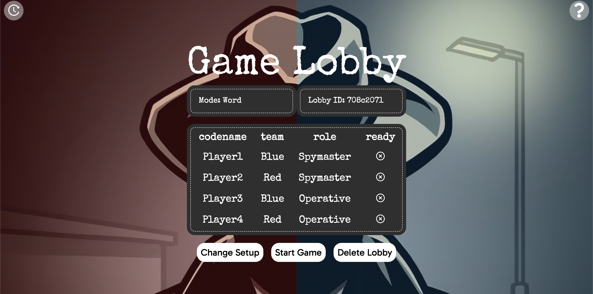
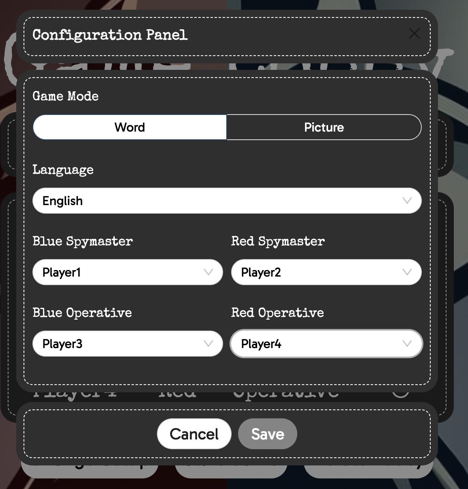
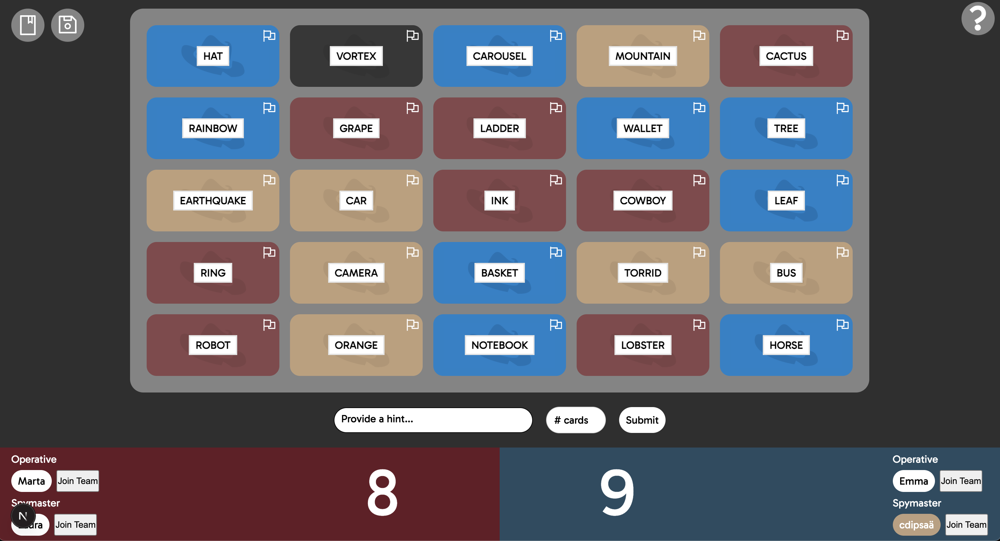

# Codenames Web Application

A web-based implementation of the popular board game *Codenames*, designed to provide an engaging and interactive multiplayer experience. This project leverages modern web technologies to deliver real-time gameplay with state persistence and a user-friendly interface.

## Introduction

The goal of this project is to create a web version of *Codenames* that allows players to join lobbies, interact with game cards, and play collaboratively or competitively. The motivation behind this project is to explore real-time state management, responsive UI design, and persistence mechanisms in a React-based application.

## Technologies Used

- **TypeScript**: For type-safe development.
- **React**: For building the user interface.
- **Redux**: For state management.
- **Ant Design Icons**: For UI components.
- **Framer Motion**: For animations.
- **npm**: For dependency management.

## High-Level Components

1. **Lobby Management**:
    - Handles lobby creation and persistence.
    - Key file: [`app/hooks/lobby/useLobbyPersist.ts`](app/hooks/lobby/useLobbyPersist.ts).
    - Manages the lobby state and ensures users can join or rejoin games seamlessly.

2. **Game Card Interaction**:
    - Manages the game card interactions, including flipping and selecting cards.
    - Key file: [`app/components/gameCard.tsx`](app/components/gameCard.tsx).
    - Ensures that the game state is updated correctly based on user interactions.

3. **Game Persistence**:
    - Ensures that the game state, including the `gameId` and `username`, is saved to and restored from `localStorage` to provide a seamless user experience across page reloads.
    - Key file: [`app/hooks/game/useGamePersist.ts`](app/hooks/game/useGamePersist.ts).
    - Features:
        - Saves the `gameId` and `username` to `localStorage` whenever they change.
        - Restores the `gameId` and `username` from `localStorage` on page reload.
        - Automatically fetches the game state if it was previously saved.

These components work together to ensure a smooth user experience. For example, the lobby management system ensures users can join or rejoin games, while the game card interaction system handles gameplay logic.
## Launch & Deployment

### Prerequisites

- Install Node.js and npm.
- Clone the repository:
```bash
git clone https://github.com/cyrimu/sopra-fs25-group-16-client.git
```

### Installing Dependencies

Run the following command to install all required dependencies:
```bash
npm install
```

### Running the Application Locally

Start the development server:
```bash
npm start
```

### Running Tests

Run the automated tests:
```bash
npm test
```

### Deployment

To build the project for production:
```bash
npm run build
```

Ensure any external dependencies (e.g., a database or API) are running before deployment.

## Illustrations

### Main User Flow

1. **Lobby Creation**: Users can create or join a lobby. The lobby state is persisted in `localStorage` for seamless rejoining. The rules can be accessed throughout.
2. **Lobby Configuration**: Host can configure the game settings, including the game mode (text or image), language, and player roles.
3. **Gameplay**: Players interact with game cards, which update dynamically based on the game state. A log of previous turns is also accessible. 
4. **Game End**: The game concludes with a winner announcement, and players can choose to play again or leave the lobby.
6. **Game Persistence**: The game state is saved to `localStorage`, allowing users to return to their game even after a page reload.
#### Screenshots

- **Lobby Screen**:
  

- **Game Setup**:
  

- **Game Screen**:
  

## Roadmap

1. **Support for Different Player Counts**: Allow games to be played with a configurable number of players, not limited to 4.
2. **Chat Functionality**: Add an in-game chat feature for players to communicate during gameplay.
3. **Viewer Mode**: Introduce a spectator mode where users can watch ongoing games without participating.

## Authors and Acknowledgment

- **Rashmi Dindgur**
- **Sergi Garcia Montmany**
- **Calvin Koch**
- **Cyril Müller**
- **Piotr Wojtaszewski**

**Special thanks to our Tutor Silvan for his support and guidance throughout the project.**

## License
This project is licensed under the MIT License.
